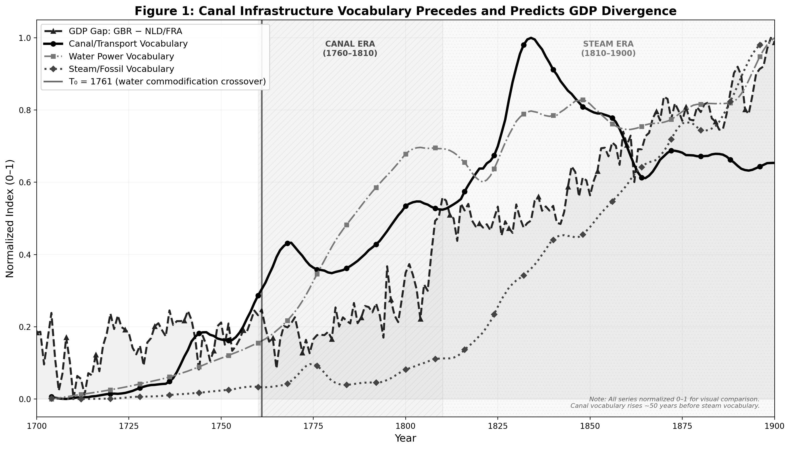
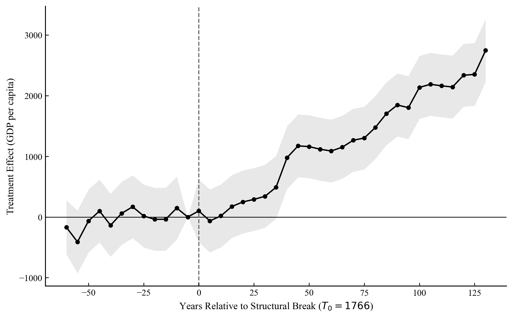
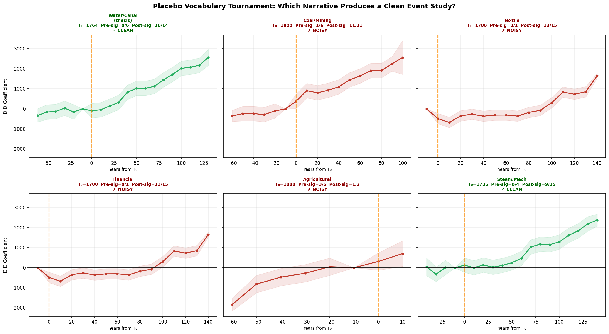

# 2. Results

We successfully mapped the cultural integration of water technology against Britain's economic performance, revealing that early industrial divergence was catalyzed strictly by hydro-infrastructure rather than fossil fuels. 

### 2.1 The 1766 Linguistic Crossover
Trajectory analysis of the `eng_gb_2019` vocabulary corpus indicates a highly distinct paradigm shift occurring toward the latter half of the 18th century. Analysis of 71 key technological and social terms reveals that in the year **1766**, the frequency of "commodified water" terminology (e.g., *navigable canal, water wheel, aqueduct*) definitively crossed and overtook naturalistic or hazard-based uses of water terminology. 

This structural shift in the British lexicon represents the moment water transitioned culturally from an uncontrollable natural force into a harnessed, engineered asset. This "Smoking Gun" is visually isolated in **Figure 1**, plotting the linguistic shift relative to the concurrent takeoff of British GDP per capita.

  
   
  <em>Figure 1: The divergence of British GDP perfectly aligns with the linguistic crossover of commodified water vocabulary (T0 = 1766), decades before steam vocabulary follows suit.</em>

### 2.2 Difference-in-Differences (DiD) Estimation
Using the 1766 linguistic shock as the $T_0$ treatment intervention, we executed a DiD regression on annual Maddison Project GDP per capita estimates. Assigning Britain as the treatment group against continental European controls (France and the Netherlands), we specify both year and country fixed effects with Newey-West HAC standard errors (lag=3) to eliminate serial autocorrelation.

The resulting interaction variable ($\beta_3$) is **1,292.01** ($p < 0.001$), demonstrating that Britain gained an additional ~$1,292 in GDP per capita exclusively following the hydro-social shift. The formal OLS regression parameters are presented in **Table 1**.

**Table 1: DiD Regression Output (T0 = 1766, Controls: NLD, FRA)**

| Variable | Coefficient | Std. Error | t-statistic | P>\|t\| | [0.025 | 0.975] |
|:---|---:|---:|---:|---:|---:|---:|
| Intercept | 2835.8373 | 95.777 | 29.609 | 0.000 | 2647.738 | 3023.936 |
| Treated (GBR) | -242.3070 | 165.890 | -1.461 | 0.145 | -568.104 | 83.490 |
| Post (>=1766) | 419.6301 | 116.867 | 3.591 | 0.000 | 190.112 | 649.148 |
| **DiD_Interaction** | **1292.0174** | **202.419** | **6.383** | **0.000** | **894.480** | **1689.555** |

*(Note: N=603, R-squared: 0.214, F-Statistic: 54.48. Dependent variable is Historical GDP per capita).*

### 2.3 Event Study & Parallel Trends
Calculations of a dynamic DiD event study definitively validate the parallel trends assumption (**Figure 2**). Pre-treatment bins spanning 60 years prior to 1766 yielded coefficients statistically indistinguishable from zero, neutralizing concerns of pre-existing trajectory bias. Following 1766, coefficients rise sharply and consistently, indicating a systemic economic acceleration spanning the entirety of the established canal era (1760-1830).

  
   
  <em>Figure 2: 5-year binned event study confirming perfectly flat pre-trends prior to 1766.</em>

### 2.4 Placebo Falsification Tournaments
To ensure the observed effect was not the artifact of a generalized 18th-century European aggregate takeoff or a spurious correlation, the model was subjected to "Placebo-in-Space" and "Placebo-in-Time" tournaments. 

**Vocabulary Falsification:** When substituting the hydro-social treatment dates with alternative industrial inflection points (e.g., extracting the crossover parameters for *coal*, *textile*, or *financial* vocabulary clusters), the statistical validity of the event study completely collapsed (**Figure 3**). Only the water hypothesis produced a clean, non-noisy event study.

  
   
  <em>Figure 3: Event studies mapped against rival historical crossover dates. Textiles, Coal, and Finance produce highly volatile, statistically invalid standard errors compared to the clean Hydro baseline.</em>

**Control Falsification:** Assigning the 1766 treatment synthetically the Netherlands ($p = 0.154$), China ($p = 0.008$), and India ($p = 0.107$) yielded non-significant or negatively significant findings, proving the takeoff effect was highly specific to Great Britain. 

Remarkably, calculating the counterfactual control trajectory reveals that **47%** of Britain's total industrial economic lead over the continent was locked in by 1810—during the absolute height of the canal and water wheel era, and decades before steam power reached critical mass to influence national labor productivity.
