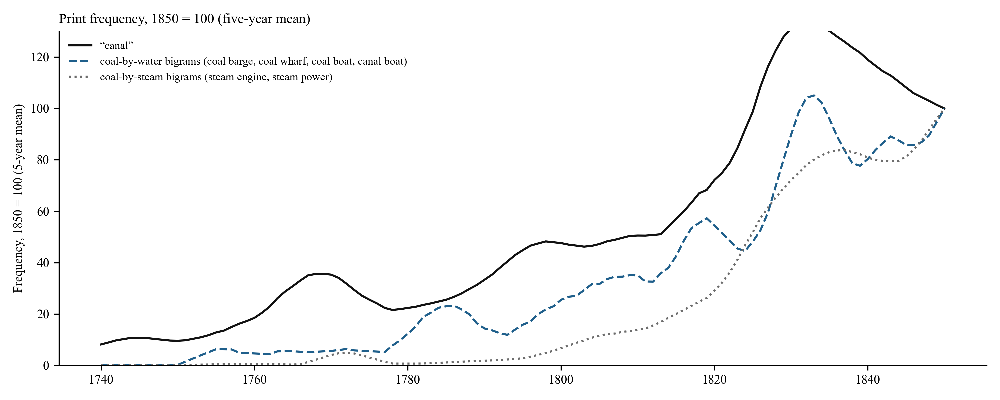
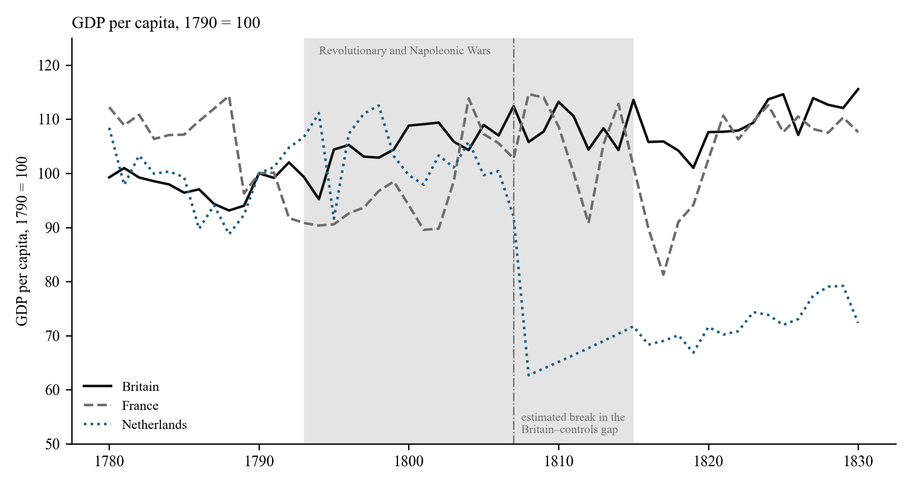

# 4. Results

## 4.1 Two growth regimes

Figure 1 plots the British series on a logarithmic scale with the two canal-building waves shaded. Panel (a) shows total output, population and income per head; panel (b) shows coal, industry and agriculture. The visual impression is of a fan opening after 1760: total output and population steepen together while income per head continues at its previous slope until the 1820s. Agriculture never steepens at all.

  
   
  <em><strong>Figure 1: Britain's two growth regimes.</strong> Annual indices, 1700 = 100, log scale. Shaded bands mark the first canal wave (1760–1780) and the canal-mania completions (1790–1816). Vertical lines at 1761 and 1818. Source: Bank of England millennium dataset (Broadberry et al. 2015).</em>

Table 1 gives the trend growth rates by period. Between 1700–1760 and 1790–1815, the growth of total output nearly tripled, coal's more than tripled and population's quadrupled. Income per head grew at 0.25 per cent a year in the first period, 0.08 in 1760–1790 and 0.40 in 1790–1815. Agriculture is flat throughout.

**Table 1: Trend growth of British series, per cent per year**

| Period | Total GDP | Industry | Coal | Services | Population | GDP per head | Agriculture |
|:--|--:|--:|--:|--:|--:|--:|--:|
| 1700–1760 | 0.55 | 0.47 | 0.87 | 0.50 | 0.29 | 0.25 | 0.75 |
| 1760–1790 | 0.82 | 1.16 | 2.05 | 0.83 | 0.74 | 0.08 | 0.60 |
| 1790–1815 | 1.58 | 1.81 | 2.85 | 2.02 | 1.18 | 0.40 | 0.81 |
| 1815–1830 | 1.98 | 3.64 | 2.84 | 1.62 | 1.49 | 0.50 | 0.63 |
| 1830–1870 | 2.35 | 2.85 | 3.57 | 2.62 | 1.16 | 1.19 | 0.78 |

*Source: own calculations from the Bank of England millennium dataset (Broadberry et al. 2015). Slopes of log-linear trends fitted within each window.*

Table 2 formalises the comparison. Fixing the break at 1761 and estimating over 1700–1830, the trend slope rises by between 0.83 (population) and 3.24 (iron) percentage points a year for every canal-served series, all with p-values below 0.01 under Newey–West errors. The slope of income per head changes by 0.02 points and that of agriculture by −0.04, neither distinguishable from zero. The fixed date is a pre-test, so the table also reports the break the data choose. The single best break falls between 1777 (population) and 1792 (total output) for every canal-served series, with sup-F statistics far above the Andrews critical value, and at 1818 for income per head. Agriculture's best break is not significant: there is none. Allowing two breaks places the first in 1774–1775 for total output, industry and services and the second in 1818–1823 for output and industry; coal's first break falls earlier, in 1741, and its second in 1798, which we return to below. The data pick out the two regimes without being told where to look.

**Table 2: Change in trend slope at 1761 and data-chosen break dates**

| Series | Trend before 1761, % per year | Change after 1761, points per year | p | Best single break (sup-F) | Best two breaks |
|:--|--:|--:|--:|--:|:--|
| Total GDP | 0.52 | +0.85 | <0.01 | 1792 (778) | 1775, 1818 |
| Industry | 0.39 | +1.42 | <0.01 | 1789 (909) | 1774, 1823 |
| Coal | 0.77 | +1.62 | <0.01 | 1784 (667) | 1741, 1798 |
| Iron | 0.26 | +3.24 | <0.01 | 1786 (1,294) | 1786, 1815 |
| Textiles | 0.69 | +1.51 | <0.01 | 1779 (240) | 1728, 1817 |
| Services | 0.44 | +1.07 | <0.01 | 1786 (927) | 1775, 1844 |
| Population | 0.23 | +0.83 | <0.01 | 1777 (3,052) | 1730, 1783 |
| *GDP per head* | 0.29 | +0.02 | 0.82 | 1818 (270) | 1720, 1818 |
| *Agriculture* | 0.82 | −0.04 | 0.84 | none (4.2, not significant) | 1720, 1757 |

*Slope-change regressions on 1700–1830 with Newey–West (10 lags) errors. Break searches on 1700–1870: Andrews sup-F with 15 per cent trimming (5 per cent critical value approximately 11.8 for two parameters) and a two-break grid search with a minimum segment of 20 years, which cannot place a break after 1850.*

The arithmetic of the first regime is simple. Between 1760 and 1815 the growth of total output and the growth of population each rose by about a percentage point a year: the economy grew faster and fed more people at the same income, for half a century, while coal output per head doubled, from an index of 100 in 1700 to 202 in 1790 and 246 in 1800. Coal's early break in 1741 is a reminder that the coal trade did not begin with canals (Hatcher 1993; Flinn 1984); what the canal era added was inland coal, and the second break in 1798 dates it.

## 4.2 The canal network as a dose

Figure 2 shows the canal series. Panel (a) gives miles opened per decade: 117 in the 1760s, 353 in the 1770s, a lull of 83 in the 1780s, then 548 in the 1790s, 479 in the 1800s and 344 in the 1810s. Panel (b) gives the cumulative stock, from 218 miles in 1760 to 772 in 1790, 1,487 in 1800 and 2,320 in 1830. Panel (c) gives coal output per head. The correspondence between the two waves and the two steepenings of coal per head is visible to the eye; the regressions ask whether it survives detrending.

  
   
  <em><strong>Figure 2: The canal network and coal.</strong> (a) Canal miles opened per decade, 155 canals by completion year. (b) Cumulative canal miles since 1700. (c) Coal output per head, 1700 = 100, with the year steam overtook water and wind as a source of stationary power. Sources: canal reference table described in the data section; Bank of England millennium dataset (Broadberry et al. 2015); horsepower benchmarks from Kanefsky as tabulated in Crafts (Kanefsky 1979; Crafts 2004).</em>

Table 3 reports the dose-response regressions over 1700–1830. In the simplest specification, log output on a linear trend and the canal stock, a thousand miles of canal is associated with 47 per cent more coal, 40 per cent more industrial output, 99 per cent more iron, 32 per cent more services and 24 per cent more population, and with no change in income per head or agriculture. The sceptical specifications thin this out. With a quadratic trend and a war dummy, coal, iron and services retain large and significant coefficients; population is marginal; industry and total output are indistinguishable from the trend. In first differences with ten lags of new mileage, coal, industry and population respond, total output and income per head do not, and agriculture's response is negative. In a horse race against the print frequency of "steam", coal's canal coefficient is 41 per cent against an insignificant 13 for steam. A horse race against installed steam horsepower is not informative: over 1760–1830 the interpolated horsepower series and the canal stock correlate at 0.98, so partial coefficients apportion a common trend. The ordering evidence must come from timing.

**Table 3: Canal stock and British output, 1700–1830 (per 1,000 canal miles)**

| Outcome (log) | Linear trend | Quadratic trend + war | First differences, 10-year cumulative | Horse race: canal | Horse race: "steam" in print |
|:--|--:|--:|--:|--:|--:|
| Coal | +46.5% (p<0.001) | +29.8% (p=0.001) | +27.0% (p<0.001) | +40.8% (p<0.001) | +12.6% (p=0.08) |
| Industry | +40.1% (p<0.001) | −0.9% (p=0.89) | +14.3% (p<0.001) | +28.8% (p<0.001) | +30.4% (p=0.003) |
| Iron | +99.3% (p<0.001) | +61.2% (p=0.013) | — | — | — |
| Services | +32.3% (p<0.001) | +12.2% (p=0.002) | — | — | — |
| Population | +24.0% (p<0.001) | +4.1% (p=0.07) | +16.6% (p<0.001) | +18.6% (p<0.001) | +15.0% (p<0.001) |
| Total GDP | +24.7% (p<0.001) | +2.2% (p=0.52) | +4.2% (p=0.25) | +18.8% (p<0.001) | +19.0% (p<0.001) |
| *GDP per head* | +0.8% (p=0.69) | −1.9% (p=0.61) | −12.4% (p=0.33) | +0.2% (p=0.94) | +4.0% (p=0.08) |
| *Agriculture* | −0.5% (p=0.90) | −5.1% (p=0.56) | −18.8% (p<0.001) | −1.5% (p=0.72) | +7.3% (p=0.07) |

*Newey–West errors with 10 lags. The first-difference column reports the sum of the coefficients on lags 0–10 of new mileage, with the p-value of the joint F-test that all eleven are zero. The steam regressor is the Google Books frequency of "steam", indexed to 1830. The war dummy covers 1756–63, 1775–83 and 1793–1815. An augmented Dickey–Fuller test rejects a unit root in the residuals of the linear-trend regressions at 5 per cent for every outcome except population (p = 0.24).*

Two features of Table 3 matter. Coal is the robust channel, and it is the channel the mechanism predicts, since the canals were dug to move it. And the placebo rows behave: income per head does not respond in any specification, and agriculture's only significant coefficient is negative, in first differences, the structural shift away from farming rather than an effect on it.

The reverse regression is not empty: past growth in coal, total output and population predicts subsequent canal openings, and past coal growth predicts new parliamentary authorisations with a joint p-value below 0.001. Canals were built where demand was growing. The predetermined doses address the contemporaneous part of this. With the completion stock lagged ten or fifteen years the pattern of Table 3 is unchanged: coal 48 to 49 per cent per thousand miles, industry 40 to 43, population 24 to 25, income per head nothing. With the authorisation count lagged ten years, each ten canals authorised is followed by 12 per cent more coal, 10 per cent more industrial output and 6 per cent more population, again with no response in income per head; adding the outcome's own growth over the preceding decade leaves these at 11, 9 and 5 per cent, all significant at 1 per cent. Under a quadratic trend the authorisation dose falls to 4 per cent for coal, significant only at the 7 per cent level. In local projections it predicts coal at every horizon and does not predict population, income per head or agriculture. The dose is not exogenous; what we claim is that its timing and incidence, under contemporaneous and predetermined measures alike, are those of a precondition.

## 4.3 The precondition chain

Figure 3 reports the local projections that test the sequence directly. Each panel shows the cumulative response of the outcome, in log points, to a unit of the regressor, at horizons of one to twenty years, with 95 per cent Newey–West bands whose bandwidth grows with the horizon. The responses are predictive, not causal.

  
   
  <em><strong>Figure 3: Local projections along the precondition chain.</strong> Cumulative log response at horizons 1–20 years, per 1,000 canal miles or per log point of the regressor, controlling for the outcome's level and a trend. Samples 1700–1830 where the canal stock is the regressor and 1760–1830 where steam horsepower enters, including the steam-to-income panel. Shaded: 95 per cent bands with Newey–West bandwidth equal to the larger of ten years and the horizon.</em>

The top-left panel is the first link: a thousand miles of canal raises coal output by 29 per cent after five years, 38 per cent after ten and 44 per cent after fifteen, with the band excluding zero at every horizon shown. Controlling for contemporaneous steam horsepower, estimated from 1760, the canal effect on coal remains at 21 per cent over five to ten years and is gone at fifteen to twenty. The top-middle panel, canal stock to steam horsepower, is positive and precisely estimated at every horizon, but because the horsepower series is interpolated between four benchmarks, the panel establishes that steam capacity rose after the network did, not how fast. The top-right panel, coal to steam, is positive at every horizon but significant only at five years. On the interpolated series that is as much as can be asked.

The bottom row is the test that distinguishes a precondition from a cause. Canal stock has no effect on income per head at any horizon (bottom-left); the point estimates are negative and the bands include zero throughout. Steam horsepower has no effect on income per head when the sample stops at 1830 (bottom-middle). On the 1760–1870 sample it does, at every horizon and with p-values below 0.002; estimated on 1830–1870 alone the response is again positive at every horizon with p-values below 0.001, and an interaction of horsepower with a post-1830 indicator is positive and significant. The elasticities, between 0.2 and 0.9 depending on sample and horizon, should not be read as magnitudes; the sign and the timing are the result. Steam's per-capita dividend is a post-1830 phenomenon. Canals raise coal and population (the population response is 3 to 7 per cent per thousand miles over five to twenty years, significant beyond five years at the family-wise threshold) and leave income per head where it was. The bottom-right panel, agriculture, is negative at intermediate horizons, again the composition effect, and returns to zero.

Because the horsepower series is interpolated, we re-estimate the steam links with the print frequency of "steam engine", which correlates at 0.90 with interpolated horsepower but varies year to year. The ordering survives, more weakly: the canal stock predicts "steam engine" at ten years (p = 0.06) and coal output predicts it at twenty (p = 0.003). The print series predicts income per head negatively at fifteen years, a warning about the series rather than about steam: it records discussion of engines, not the power they supplied. The last link of the chain therefore rests on the horsepower benchmarks, the 1818 break in income per head and the 1833 crossover in installed power.

The chain, read from Figure 3 and Table 4, is: canals raise coal within a decade; steam capacity rises after the network and after coal, on a scale that only the benchmarks can date; steam raises income per head, but only once it is the majority power source. Water first, coal second, steam third, income last.

## 4.4 How much power was steam?

The precondition thesis requires that the first regime run on water rather than steam. Table 4 uses the Kanefsky benchmarks to check. In 1760 steam supplied about 6 per cent of Britain's installed stationary power; in 1800, when the first regime was thirty years old, 21 per cent; by 1820 about a third; in 1830 parity with water, at 47 per cent. Steam overtook water and wind combined in 1833, fifteen years after the per-capita break. Coal output per unit of installed steam horsepower fell from 100 to 37 between 1760 and 1800: coal grew far faster than the engines that could burn it, and most of it went to hearths, forges, kilns and salt pans, moved by water.

**Table 4: Installed stationary power in Britain, thousands of horsepower**

| Year | Steam | Water | Wind | Steam share | Coal output per steam hp (1760 = 100) |
|:--|--:|--:|--:|--:|--:|
| 1760 | 5 | 70 | 10 | 6% | 100 |
| 1800 | 35 | 120 | 15 | 21% | 37 |
| 1830 | 160 | 160 | 20 | 47% | 19 |
| 1870 | 2,060 | 230 | 10 | 90% | 6 |

*Source: Kanefsky's estimates as tabulated in Crafts (Kanefsky 1979; Crafts 2004); coal output from the Bank of England millennium dataset (Broadberry et al. 2015). Shares from log-linear interpolation between benchmarks, wind included.*

## 4.5 The semantic sequence

If coal moved by water before it burned in engines, the language of the period should say so. Table 5 records, for each term or group, the first year in which its smoothed frequency in the British corpus reached 10, 25 and 50 per cent of its 1850 level. "Canal" reaches a quarter of its mid-century frequency in 1763, the year after the Bridgewater opening; "coal barge" in 1781; "coal wharf" in 1800; "canal boat", a later coinage, in 1823. "Steam engine" reaches the same threshold in 1808 and "steam power" in 1826. The coal-by-water group as a whole crosses 25 per cent in 1800, the coal-by-steam group in 1819. "Steam engine" overtakes "fire engine", the older name for the same machine, in 1800, which dates the terminological consolidation of steam to the decade after the canal mania. Figure 4 plots the three indices.

**Table 5: Year in which print frequency first reaches a share of its 1850 level (British English corpus, five-year mean)**

| Term or group | 10% | 25% | 50% |
|:--|--:|--:|--:|
| "canal" | 1743 | 1763 | 1809 |
| "coal barge" | 1753 | 1781 | 1783 |
| "coal wharf" | 1774 | 1800 | 1815 |
| "canal boat" | 1812 | 1823 | 1825 |
| Coal-by-water group | 1780 | 1800 | 1817 |
| "steam engine" | 1800 | 1808 | 1821 |
| "steam power" | 1821 | 1826 | 1831 |
| Coal-by-steam group | 1804 | 1819 | 1825 |
| "coal field" | 1788 | 1820 | 1831 |

*Source: Google Books Ngram corpus, British English 2019 edition, three-year API smoothing and a five-year centred mean. Groups are equal-weighted averages of member terms each indexed to 1850; the coal-by-water group also contains "coal boat", which is too rare before 1800 to threshold on its own.*

  
   
  <em><strong>Figure 4: In print, coal travels by water before it is burned in engines.</strong> Five-year moving averages indexed to 1850 = 100. Coal-by-water: equal-weighted "coal barge", "coal wharf", "coal boat", "canal boat". Coal-by-steam: "steam engine", "steam power". Source: Google Books Ngram corpus, British English 2019 edition.</em>

The ordering does not depend on the smoothing or the reference year. Across three-, five- and nine-year windows and with 1830 or 1850 as reference, "coal barge" crosses a quarter of its reference level in 1780–1781, "canal" in 1763–1766, "steam engine" in 1807–1809 and "steam power" in 1822–1826; the coal-by-water group crosses between 1785 and 1801 and the coal-by-steam group between 1814 and 1819 in every combination. "Coal wharf" is the one sensitive term, crossing in 1776 or 1800 depending on the reference, and in both cases before steam. Read as decades, the order is stable.

The corpus also tells us what kind of thing the infrastructure vocabulary measures. The frequency of "canal" correlates at 0.91 with the cumulative mileage of canals in existence over 1740–1850 and at −0.04 with the mileage opened in the surrounding decade; linearly detrended, the first correlation falls to 0.23, and in first differences to 0.16. Print records the level of the network, which is written about every year it exists, not the rate of building. The vocabulary index is a fair proxy for infrastructure in place and a poor one for investment, and we use it only in the first sense.

## 4.6 The comparative cases: water without coal, coal without water

Tvedt's thesis is comparative, and the British result gives it a form the comparative cases can be checked against. If engineered water was a precondition for a coal economy and coal the fuel of the second regime, then an economy with waterways and no coal should show at most the first regime; an economy with coal and no engineered water should show neither until the water arrives; and an economy that acquires both late should run the sequence compressed. Annual series joining output, canal building and installed power are not available elsewhere, so the check is at the Maddison benchmark years, where population is measured rather than interpolated, read alongside what the national literatures record about fuel and water. Table 6 gives growth between 1700 and 1820, before steam supplied a third of British power, and between 1820 and 1870.

**Table 6: Growth between benchmark years, per cent**

| | GDP per head 1700–1820 | Population 1700–1820 | Total GDP 1700–1820 | GDP per head 1820–1870 |
|:--|--:|--:|--:|--:|
| Britain (UK, Maddison) | +37 | +148 | +240 | +76 |
| Great Britain (Broadberry) | +37 | +125 | +209 | +76 |
| Germany | +35 | +66 | +124 | +44 |
| Belgium | +8 | +72 | +85 | +82 |
| Spain | +22 | +39 | +69 | +16 |
| France | +3 | +46 | +50 | +65 |
| Sweden | −29 | +104 | +44 | +52 |
| Netherlands | −11 | +23 | +9 | +47 |
| China | −43 | +176 | +58 | +7 |

*Sources: Maddison Project Database 2023 (Bolt and van Zanden 2025); Great Britain row from the Bank of England millennium dataset (Broadberry et al. 2015). The 1700 figure for China is contested (Broadberry, Guan, and Li 2018).*

On either measure British output roughly tripled between 1700 and 1820, and Britain was the only economy in the panel to more than double its population while raising income per head; Germany doubled its output and France grew by half.

The Netherlands is the case of water without coal. By the 1660s it had built more than six hundred kilometres of trekvaarten, towpath canals with scheduled barge services, on top of the densest river and drainage network in Europe (de Vries 1978). It ran on peat, which gave it in the seventeenth century an energy supply per head no other European economy matched, and it imported the coal it burned from Newcastle and Liège (de Zeeuw 1978; Kander, Malanima, and Warde 2013). What it lacked, besides coal, was gradient: a country at sea level has water to float on and little to fall, and Dutch industry was powered by wind. Its total output grew 9 per cent between 1700 and 1820 and its income per head fell, for reasons the literature locates in trade, finance, wages and war rather than fuel (de Vries and van der Woude 1997). The case shows that water transport was not sufficient; it does not, on its own, show that coal was what was missing. What it shows is that the densest engineered waterways in Europe, with no cheap domestic fuel to carry and no falling water to drive mills, did not compound.

Belgium is the case of coal that waited for water, and it is the nearest thing in the panel to an experiment on the sequence. The Hainaut and Liège coalfields were worked throughout the eighteenth century, but the Mons–Condé canal that joined the Borinage to the Scheldt opened in 1818 and the Charleroi–Brussels canal in 1832 (Mokyr 1976). Belgian income per head grew 8 per cent between 1700 and 1820, less than Spain's, and 82 per cent between 1820 and 1870, more than Britain's, on the way to the densest railway network on the continent. Belgium ran Britain's sequence in a third of the time, and it began after the canals reached the pits. The second regime could arrive so quickly because steam, by 1820, was a technology that could be imported; the first regime could not be, because it was built into the ground.

China is the case of coal and water that did not meet. The Grand Canal, some 1,800 kilometres from Hangzhou to Beijing, was the longest artificial waterway in the world and a state conduit for grain (Elvin 1973). China's coal lay in the north-west, in Shanxi and Shaanxi, a thousand kilometres from the Jiangnan core where the population, the textile industry and the demand for fuel were (Pomeranz 2000). The rivers that might have joined them were of the wrong kind: the Yellow River carried silt rather than barges and changed course, and the monsoon gave rivers and canals alike a wet season and a dry one (Tvedt 2010). The benchmarks record a 176 per cent rise in population and a 43 per cent fall in income per head between 1700 and 1820, though the 1700 level is contested (Broadberry, Guan, and Li 2018), and 7 per cent per-capita growth in the half-century after. This is what a Malthusian regime looks like, and it is the regime Britain left in aggregate in the 1770s and per head in 1818: an economy that had exhausted its organic frontier and could not reach its mineral one.

India we treat in a sentence, on Parthasarathi's evidence. Its coal lay in Bengal, at Raniganj, while its export industry, cotton, lay in Gujarat and on the Coromandel coast, and the rivers between ran with the monsoon (Parthasarathi 2011; Tvedt 2010). The endowment was China's problem in a different geography.

None of these cases is a test in the sense that the British series are. They are four readings of one rule, and the rule is what the British result supplies: the economies with engineered water and no coal, or coal and no engineered water, did not leave the organic regime in this period; the two that had both, Britain from the 1770s and Belgium from the 1820s, did, in the order the precondition predicts. A comparative paper with regional series for the Low Countries and the Yangzi delta could turn the readings into tests.

## 4.7 Why we stop at benchmark years

The natural cross-country test of an eighteenth-century British take-off is a difference-in-differences on Maddison GDP per head, treating Britain from 1761 against continental controls. In logs, with France and the Netherlands as controls and year and country effects, it returns treatment coefficients of 0.08 to 0.31 with p-values below 0.001 for every control group and window we tried. Taken at face value they say that Britain pulled away from the continent from 1761. They should not be. Britain's gap to the controls is significantly negative in the 1700s and 1710s, so there is no parallel pre-trend to break. A sup-F search on the log gap to the Netherlands and France places the single break in 1807, and Figure 5 shows what happened then: Britain's income per head, indexed to 1790, stood at 109 in 1805 and 114 in 1815; the Netherlands' at 100 in 1805, 63 in 1808 and 72 in 1815. Underneath both, Britain's own income per head grew at 0.08 per cent a year between 1760 and 1790. There was no canal-era per-capita acceleration for any control group to reveal.

Table 7 gives the drawdowns. Between the late 1780s and the Napoleonic trough the Netherlands lost 44 per cent of its income per head, Portugal 48, Sweden 27, France 22 and Spain 13. Britain lost 1.4 per cent. The 1761 "treatment effect" measured against a continental control group is, to a first approximation, the difference between being blockaded and doing the blockading. That is why the comparative evidence above is read at benchmark years and for aggregate output: over 1790–1815 the per-capita series record the war, not the rivers.

**Table 7: GDP per head, peak 1785–95 to trough 1795–1815 (Maddison Project Database 2023, 2011 international dollars)**

| Country | Peak | Trough | Drawdown | 1815 relative to 1790 |
|:--|--:|--:|--:|--:|
| Britain (UK) | 3,207 (1795) | 3,161 (1798) | −1.4% | +13.6% |
| Netherlands | 4,666 (1794) | 2,632 (1808) | −43.6% | −28.3% |
| Portugal | 2,063 (1785) | 1,072 (1811) | −48.0% | −24.1% |
| Sweden | 1,661 (1791) | 1,221 (1809) | −26.5% | −11.9% |
| France | 2,016 (1788) | 1,580 (1801) | −21.7% | +1.3% |
| Spain | 1,454 (1790) | 1,265 (1811) | −13.0% | +3.2% |
| Germany | 1,820 (1792) | 1,725 (1805) | −5.2% | +8.1% |

*Source: Maddison Project Database 2023 (Bolt and van Zanden 2025). The series labelled Britain is the United Kingdom, including Ireland.*

  
   
  <em><strong>Figure 5: The 1807 "break" in the cross-country design is the Dutch collapse.</strong> GDP per head, 1790 = 100, for Britain, France and the Netherlands, with the Revolutionary and Napoleonic war years shaded and the estimated break in the Britain–controls gap marked. Source: Maddison Project Database 2023 (Bolt and van Zanden 2025).</em>

