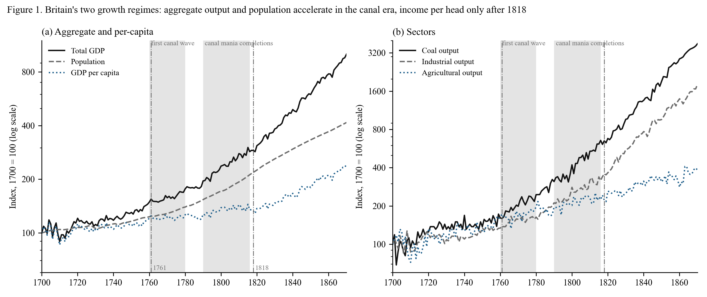
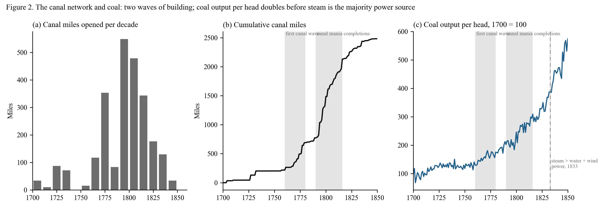
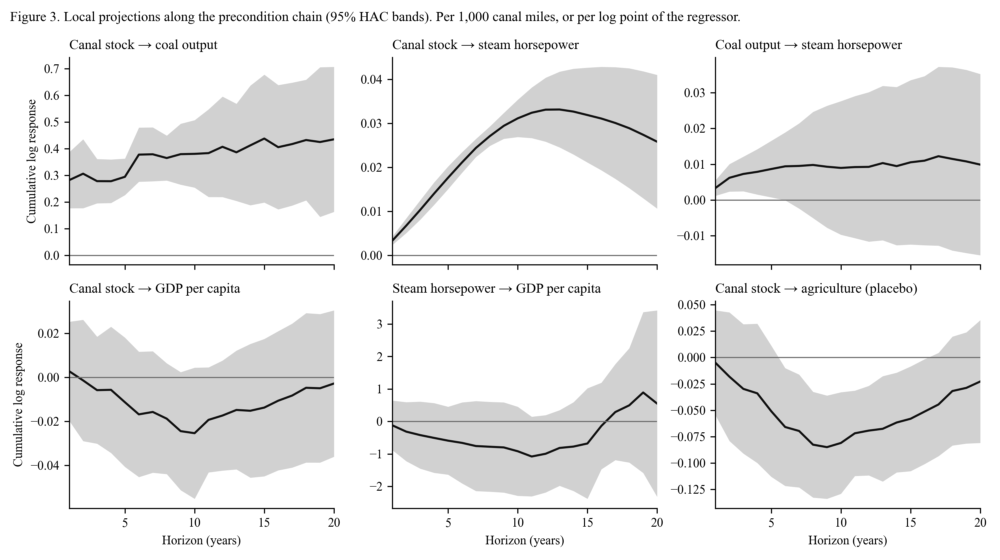
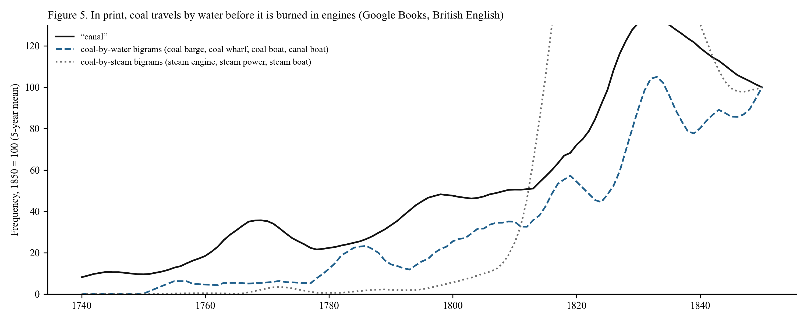
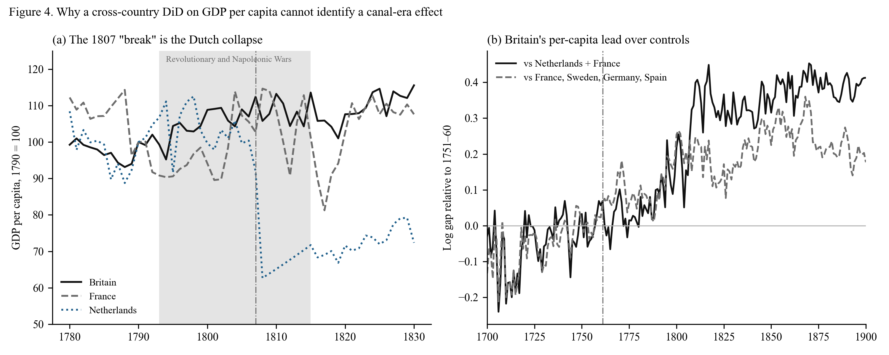
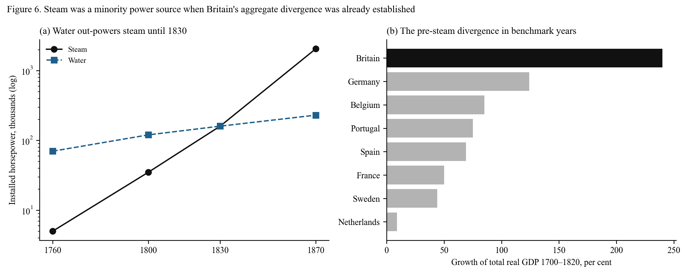

# 4. Results

## 4.1 Two growth regimes

Figure 1 plots the British series on a logarithmic scale with the two canal-building waves shaded. Panel (a) shows total output, population and income per head; panel (b) shows coal, industry and agriculture. The visual impression is of a fan opening after 1760: total output and population steepen together while income per head continues at its previous slope until the 1820s. Agriculture never steepens at all.

  
   
  <em><strong>Figure 1: Britain's two growth regimes.</strong> Annual indices, 1700 = 100, log scale. Shaded bands mark the first canal wave (1760–1780) and the canal-mania completions (1790–1816). Vertical lines at 1761 and 1818. Source: Broadberry et al. (2015) via Bank of England.</em>

Table 1 gives the trend growth rates by period. Between 1700–1760 and 1790–1815, growth of total output rose from 0.55 to 1.58 per cent a year, industry from 0.47 to 1.81, coal from 0.87 to 2.85 and population from 0.29 to 1.18. Income per head grew at 0.25 per cent a year in the first period and 0.40 in the third; the difference is within the noise of the series. Agriculture is flat throughout.

**Table 1: Trend growth of British series, per cent per year**

| Period | Total GDP | Industry | Coal | Services | Population | GDP per head | Agriculture |
|:--|--:|--:|--:|--:|--:|--:|--:|
| 1700–1760 | 0.55 | 0.47 | 0.87 | 0.50 | 0.29 | 0.25 | 0.75 |
| 1760–1790 | 0.82 | 1.16 | 2.05 | 0.83 | 0.74 | 0.08 | 0.60 |
| 1790–1815 | 1.58 | 1.81 | 2.85 | 2.02 | 1.18 | 0.40 | 0.81 |
| 1815–1830 | 1.98 | 3.64 | 2.84 | 1.62 | 1.49 | 0.50 | 0.63 |
| 1830–1870 | 2.35 | 2.85 | 3.57 | 2.62 | 1.16 | 1.19 | 0.78 |

*Source: authors' calculations from Broadberry et al. (2015). Slopes of log-linear trends fitted within each window.*

Table 2 formalises the comparison. Fixing the break at 1761 and estimating over 1700–1830, the trend slope of total output rises by 0.85 percentage points a year, industry by 1.42, coal by 1.62, iron by 3.24, services by 1.07 and population by 0.83, all with p-values below 0.01 under Newey–West errors. The slope of income per head changes by 0.02 points and that of agriculture by −0.04, neither distinguishable from zero. When the break date is left free, the single best break falls between 1777 (population) and 1792 (total output) for every canal-served series, and at 1818 for income per head. Allowing two breaks places the first at 1774–1775 for total output, industry and services and the second at 1818–1823. The data pick out the two regimes without being told where to look.

**Table 2: Change in trend slope at 1761 and data-chosen break dates**

| Series | Trend before 1761, % p.a. | Change after 1761, pp p.a. | p | Best single break | Best two breaks |
|:--|--:|--:|--:|--:|:--|
| Total GDP | 0.52 | +0.85 | <0.01 | 1792 | 1775, 1818 |
| Industry | 0.39 | +1.42 | <0.01 | 1789 | 1774, 1823 |
| Coal | 0.77 | +1.62 | <0.01 | 1784 | 1741, 1798 |
| Iron | 0.26 | +3.24 | <0.01 | 1786 | — |
| Services | 0.44 | +1.07 | <0.01 | 1786 | 1775, 1844 |
| Population | 0.23 | +0.83 | <0.01 | 1777 | 1730, 1783 |
| *GDP per head* | 0.29 | +0.02 | 0.82 | 1818 | 1720, 1818 |
| *Agriculture* | 0.82 | −0.04 | 0.84 | 1728 | — |

*Slope-change regressions on 1700–1830 with Newey–West (10 lags) errors. Break searches on 1700–1870, Andrews sup-F with 15 per cent trimming and two-break grid search with minimum segment of 20 years.*

The arithmetic of the first regime is simple. Between 1760 and 1815 the growth of total output rose by about a percentage point a year and the growth of population rose by about a percentage point a year. The economy grew faster and fed more people at the same income. In an organic economy that is the Malthusian outcome; what is unusual is that it continued for half a century without the income per head falling, and that it coincided with the doubling of coal output per head, from an index of 100 in 1700 to 202 in 1790 and 246 in 1800.

## 4.2 The canal network as a dose

Figure 2 shows the canal series. Panel (a) gives miles opened per decade: 117 in the 1760s, 353 in the 1770s, a lull of 83 in the 1780s, then 549 in the 1790s, 479 in the 1800s and 344 in the 1810s. Panel (b) gives the cumulative stock, from 218 miles in 1760 to 772 in 1790, 1,487 in 1800 and 2,320 in 1830. Panel (c) gives coal output per head. The correspondence between the two waves and the two steepenings of coal per head is visible to the eye; the regressions ask whether it survives detrending.

  
   
  <em><strong>Figure 2: The canal network and coal.</strong> (a) Canal miles opened per decade, 155 canals by completion year. (b) Cumulative canal miles since 1700. (c) Coal output per head, 1700 = 100, with the year steam overtook water and wind as a source of stationary power. Sources: canal tables; Broadberry et al. (2015); Kanefsky (1979) via Crafts (2004).</em>

Table 3 reports the dose-response regressions over 1700–1830. In the simplest specification, log output on a linear trend and the canal stock, a thousand miles of canal is associated with 47 per cent more coal, 40 per cent more industrial output, 99 per cent more iron, 32 per cent more services and 24 per cent more population, and with no change in income per head or agriculture. The sceptical specifications thin this out. With a quadratic trend, only coal retains a large and significant coefficient, 30 per cent per thousand miles, with population marginal at 4 per cent; industry and total output are indistinguishable from the trend. In first differences with ten lags of new mileage, coal, industry and population respond and total output, income per head and agriculture do not. In the horse race with steam horsepower and war years, coal's canal coefficient is 41 per cent against a steam coefficient of 13 per cent that is not significant; for industry and population the two are of similar size and both significant.

**Table 3: Canal stock and British output, 1700–1830 (per 1,000 canal miles)**

| Outcome (log) | Linear trend | Quadratic trend | First differences, 10-year cumulative | Horse race: canal | Horse race: steam hp |
|:--|--:|--:|--:|--:|--:|
| Coal | +46.5% (p<0.001) | +29.8% (p=0.001) | +27.0% (p<0.001) | +40.8% (p<0.001) | +12.6% (p=0.08) |
| Industry | +40.1% (p<0.001) | −0.9% (p=0.89) | +14.3% (p<0.001) | +28.8% (p<0.001) | +30.4% (p=0.003) |
| Iron | +99.3% (p<0.001) | — | — | +88.2% (p<0.001) | +35.6% (p=0.17) |
| Population | +24.0% (p<0.001) | +4.1% (p=0.07) | +16.6% (p<0.001) | +18.6% (p<0.001) | +15.0% (p<0.001) |
| Total GDP | +24.7% (p<0.001) | +2.2% (p=0.52) | +4.2% (p=0.25) | +18.8% (p<0.001) | +19.0% (p<0.001) |
| *GDP per head* | +0.8% (p=0.69) | −1.9% (p=0.61) | −12.4% (p=0.33) | +0.2% (p=0.94) | +4.0% (p=0.08) |
| *Agriculture* | −0.5% (p=0.90) | −5.1% (p=0.56) | −18.8% (p<0.001) | −1.5% (p=0.72) | +7.3% (p=0.07) |

*Newey–West errors with 10 lags. Steam horsepower is the log of the interpolated Kanefsky series, indexed to 1830. The horse race includes a dummy for 1756–63, 1775–83 and 1793–1815.*

Two features of Table 3 matter for the argument. The first is that coal is the robust channel. It is also the channel the mechanism predicts, since the canals were dug to move it. The second is that the placebo rows behave. Income per head does not respond to canals in any specification, and agriculture's only significant coefficient is negative, in first differences, which is the structural shift away from farming rather than an effect on farming. We note, and return to in Section 7, that the reverse regression is not empty: past growth in coal, total output and population predicts subsequent canal openings. Canals were built where demand was growing. The dose is not exogenous, and we do not claim that it is; what we claim is that its timing and incidence are those of a precondition.

## 4.3 The precondition chain

Figure 3 reports the local projections that test the sequence directly. Each panel shows the cumulative response of the outcome, in log points, to a unit of the regressor, at horizons of one to twenty years, with 95 per cent Newey–West bands.

  
   
  <em><strong>Figure 3: Local projections along the precondition chain.</strong> Cumulative log response at horizons 1–20 years, per 1,000 canal miles or per log point of the regressor, controlling for the outcome's level and a trend. Samples 1700–1830 for canal regressors, 1760–1830 where steam horsepower enters. Shaded: 95 per cent HAC bands.</em>

The top-left panel is the first link: a thousand miles of canal raises coal output by 29 per cent after five years, 38 per cent after ten and 44 per cent after fifteen, with the whole path bounded away from zero. Controlling for contemporaneous steam horsepower, estimated from 1760, the canal effect on coal remains at 21 per cent over five to ten years and fades at fifteen to twenty, where steam takes over. The top-middle panel is the second link: canal stock predicts installed steam horsepower over fifteen to twenty years. The coefficient is small in log points because horsepower grew fifty-fold over the sample, but it is precisely estimated; we flag that the horsepower series is interpolated between five benchmarks, so this panel establishes ordering rather than magnitude. The top-right panel, coal to steam, is positive at every horizon but significant only at five years. On the interpolated series that is as much as can be asked.

The bottom row is the test that distinguishes a precondition from a cause. Canal stock has no effect on income per head at any horizon (bottom-left); the point estimates are negative and the bands include zero throughout. Steam horsepower has no effect on income per head either when the sample stops at 1830 (bottom-middle), but on the 1760–1870 sample it raises income per head by 0.55 log points per log point of horsepower after five years and 0.90 after twenty, all with p-values below 0.001. Steam's per-capita dividend is a post-1830 phenomenon. Canals raise coal and population (the population response is 3 to 7 per cent per thousand miles over five to twenty years, all significant) and leave income per head where it was. The bottom-right panel, agriculture, is negative at intermediate horizons, again the composition effect, and returns to zero.

The chain, read from Figure 3, is: canals raise coal within a decade; canals and coal are followed by steam capacity over one to two decades; steam raises income per head, but only once it is the majority power source. Water first, coal second, steam third, income last.

## 4.4 How much power was steam?

The precondition thesis requires that the first regime run on water rather than steam. Table 4 uses the Kanefsky benchmarks to check. In 1760 steam supplied about 6 per cent of Britain's stationary power; in 1800, when the first regime was thirty years old and the mania canals were opening, 21 per cent; in 1830 it had reached parity with water, at 47 per cent of the total. Steam overtook water and wind combined in 1833, fifteen years after the per-capita break. Over the same period coal output per unit of installed steam horsepower fell from 100 to 37: most of the coal being dug in 1800 was not being burned in engines. It was being carried, largely by water, to hearths, forges, kilns and salt pans.

**Table 4: Installed stationary power in Britain, thousands of horsepower**

| Year | Steam | Water | Wind | Steam share | Coal output per steam hp (1760 = 100) |
|:--|--:|--:|--:|--:|--:|
| 1760 | 5 | 70 | 10 | 6% | 100 |
| 1800 | 35 | 120 | 15 | 21% | 37 |
| 1830 | 160 | 160 | 20 | 47% | 19 |
| 1870 | 2,060 | 230 | 10 | 90% | 6 |

*Source: Kanefsky (1979, p. 338) as reported in Crafts (2004, Table 3); coal output from Broadberry et al. (2015). Shares from log-linear interpolation between benchmarks.*

## 4.5 The semantic sequence

If coal moved by water before it burned in engines, the language of the period should say so. Table 5 records, for each term or group, the first year in which its smoothed frequency in the British corpus reached 10, 25 and 50 per cent of its 1850 level. "Canal" reaches a quarter of its mid-century frequency in 1763, the year after the Bridgewater opening; "coal barge" in 1781; "coal wharf" in 1800. "Steam engine" reaches the same threshold in 1808, "steam power" in 1826, and "coal field", the geologist's term, in 1820. The coal-by-water group as a whole crosses 25 per cent in 1800, the coal-by-steam group in 1811. "Steam engine" overtakes "fire engine", the older name for the same machine, in 1800, which dates the terminological consolidation of steam to the decade after the canal mania. Figure 5 plots the three indices.

**Table 5: Year in which print frequency first reaches a share of its 1850 level (British English corpus, 5-year mean)**

| Term or group | 10% | 25% | 50% |
|:--|--:|--:|--:|
| "canal" | 1743 | 1763 | 1809 |
| "coal barge" | 1753 | 1781 | 1783 |
| "coal wharf" | 1774 | 1800 | 1815 |
| Coal-by-water group | 1780 | 1800 | 1817 |
| "steam engine" | 1800 | 1808 | 1821 |
| Coal-by-steam group | 1806 | 1811 | 1813 |
| "coal field" | 1788 | 1820 | 1831 |
| "steam power" | 1821 | 1826 | 1831 |

  
   
  <em><strong>Figure 5: In print, coal travels by water before it is burned in engines.</strong> Five-year moving averages indexed to 1850 = 100. Coal-by-water: equal-weighted "coal barge", "coal wharf", "coal boat", "canal boat". Coal-by-steam: "steam engine", "steam power", "steam boat". Source: Google Books Ngram, eng_gb_2019.</em>

The corpus also tells us what kind of thing the infrastructure vocabulary measures. The frequency of "canal" correlates at 0.91 with the cumulative mileage of canals in existence over 1740–1850 and at −0.04 with the mileage opened in the surrounding decade. Print records the network that exists, not the digging. The 1766 crossover between engineered and naturalistic water vocabulary that the earlier version of this paper reported is, on this reading, the corpus registering the first wave of openings, and the vocabulary index can be used as a proxy for infrastructure in place where physical series are missing.

## 4.6 Why the cross-country test fails

The earlier version of this paper estimated a two-way fixed-effects difference-in-differences on Maddison GDP per head, treating Britain from 1761 against France and the Netherlands, and reported a treatment effect of 1,251 international dollars with a Newey–West p-value of 0.042. We reproduce that estimate exactly. We then ask when the gap between Britain and its controls actually opened. A sup-F search on the log gap places the single break in 1807, with the next-best candidates 1805–1809. The event study of the earlier version is consistent: no post-1761 bin is significant until the one beginning 45 years after treatment.

Figure 4(a) shows what happened in 1807. Britain's income per head, indexed to 1790, stood at 106 in 1805 and 110 in 1815. The Netherlands' fell from 100 in 1805 to 63 in 1808 and was still at 72 in 1815. Table 6 gives the drawdowns for the whole panel. Between the late 1780s and the Napoleonic trough the Netherlands lost 44 per cent of its income per head, Portugal 48, Sweden 27, France 22 and Spain 13. Britain lost 1.4 per cent. The 1761 "treatment effect" measured against a continental control group is, to a first approximation, the difference between being blockaded and doing the blockading. Of the growth in the level gap between 1761 and 1900 that the earlier version's counterfactual attributed to the canal era, 39 per cent occurs in the war years 1790–1815 alone.

**Table 6: GDP per head, peak 1785–95 to trough 1795–1815 (Maddison 2023, 2011 international dollars)**

| Country | Peak | Trough | Drawdown | 1815 relative to 1790 |
|:--|--:|--:|--:|--:|
| Britain | 3,207 (1795) | 3,161 (1798) | −1.4% | +13.6% |
| Netherlands | 4,666 (1794) | 2,632 (1808) | −43.6% | −28.3% |
| Portugal | 2,063 (1785) | 1,072 (1811) | −48.0% | −24.1% |
| Sweden | 1,661 (1791) | 1,221 (1809) | −26.5% | −11.9% |
| France | 2,016 (1788) | 1,580 (1801) | −21.7% | +1.3% |
| Spain | 1,454 (1790) | 1,265 (1811) | −13.0% | +3.2% |
| Germany | 1,820 (1792) | 1,725 (1805) | −5.2% | +8.1% |

  
   
  <em><strong>Figure 4: Why a cross-country difference-in-differences on GDP per head cannot identify a canal-era effect.</strong> (a) GDP per head, 1790 = 100, for Britain, France and the Netherlands, with the war years shaded and the estimated break in the Britain–controls gap. (b) Britain's log GDP per head relative to two control groups, normalised to 1751–60. Source: Maddison Project Database 2023.</em>

Changing the control group does not rescue the design. Figure 4(b) plots Britain's log gap relative to the Netherlands and France and relative to France, Sweden, Germany and Spain, normalised to 1751–60. Against the second group Britain's relative position rises in the 1760s and again in the 1790s, but it was also rising from 1700 to 1720, so the pre-treatment bins of the event study are significantly negative and parallel trends fail in the opposite direction. The 1790s step is again a control-side collapse. And underneath all of this is the fact established in Section 4.1: Britain's own income per head grew at 0.08 per cent a year between 1760 and 1790. There was no canal-era per-capita acceleration for any control group to reveal. The difference-in-differences was measuring the right country with the wrong variable in the wrong decade.

## 4.7 The pre-steam divergence in benchmark years

What the cross-country data can establish is the aggregate divergence, and they establish it at benchmark years where population is measured rather than interpolated. Table 7 gives growth between 1700 and 1820, which is before steam supplied a quarter of British power. Britain's total output grew 240 per cent. The next European economy, Germany, grew 124 per cent; France 50; the Netherlands 9. Britain's population grew 148 per cent, more than any European country except Sweden's 104, and Britain alone among them combined that population growth with a rise in income per head of 37 per cent. Figure 6 juxtaposes this with the power benchmarks.

**Table 7: Growth between Maddison benchmark years, per cent**

| | GDP per head 1700–1820 | Population 1700–1820 | Total GDP 1700–1820 | GDP per head 1820–1870 |
|:--|--:|--:|--:|--:|
| Britain | +37 | +148 | +240 | +76 |
| Germany | +35 | +66 | +124 | +44 |
| Belgium | +8 | +72 | +85 | +82 |
| Spain | +22 | +39 | +69 | +16 |
| France | +3 | +46 | +50 | +65 |
| Sweden | −29 | +104 | +44 | +52 |
| Netherlands | −11 | +23 | +9 | +47 |
| China | −43 | +176 | +58 | +7 |

  
   
  <em><strong>Figure 6: Steam was a minority power source when Britain's aggregate divergence was already established.</strong> (a) Installed steam and water horsepower, thousands, log scale. (b) Growth of total real GDP 1700–1820. Sources: Kanefsky (1979) via Crafts (2004); Maddison Project Database 2023.</em>

The Dutch row deserves attention because it is the comparative case Tvedt's argument needs. The Netherlands had the densest network of engineered waterways in Europe by the 1660s, a barge system that de Vries has described as the first scheduled public transport in the world (de Vries 1978). It had no coal. Its total output grew 9 per cent in 120 years. Water infrastructure without coal to move was not sufficient. Belgium, which had both coal and canals, was the first continental economy to industrialise. Britain had both, and the water to make the coal cheap at the point of use.
